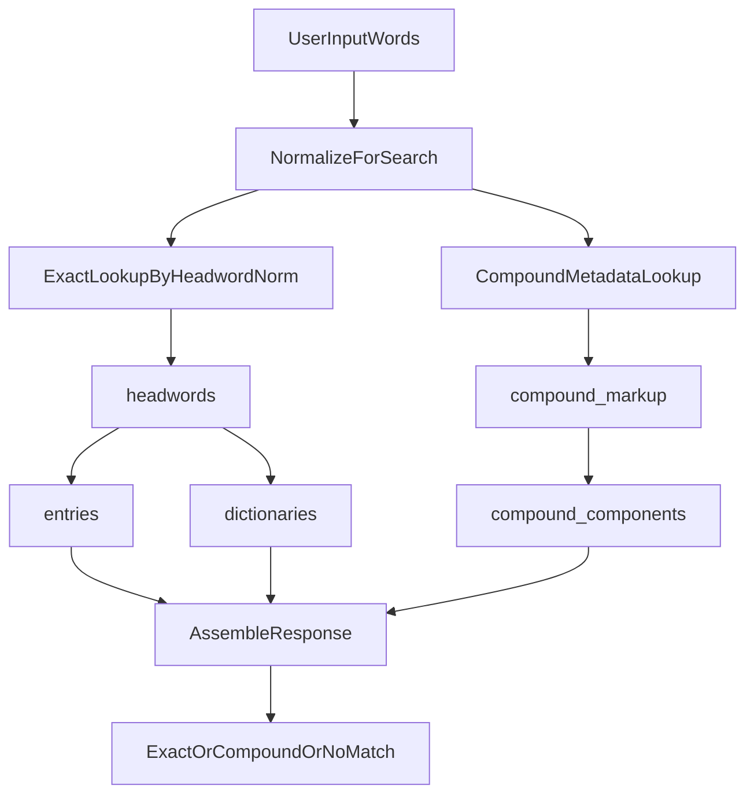

# SQLite Runtime Handoff Implementation Plan

## Goal

Provide another agent with an execution-ready plan to prepare a GitHub Pages
repository for SQLite-based search and word verification.

## Execution Sequence

1. **Inventory and Scope**
   - confirm runtime boundary: search/verification only
   - confirm out-of-scope: extraction/OCR/schema redesign
   - collect normative references from this repository

2. **Write or Update Contracts**
   - `docs/sqlite-runtime-contract.md`
   - `docs/normalization-contract.md`
   - `docs/search-contract.md`
   - `docs/word-verification-contract.md`
   - `docs/runtime-acceptance.md`

3. **Integrate Contracts Into Architecture Docs**
   - if equivalent docs already exist, merge sections without duplicating content
   - keep explicit anchors for runtime DB, normalization, and classification

4. **Define Test Plan**
   - normalization parity tests
   - exact and batch lookup tests
   - compound classification tests
   - GitHub Pages runtime smoke test

5. **Gate and Sign-off**
   - verify acceptance checklist
   - confirm docs are sufficient for an implementation agent without extra
     assumptions

## Required Runtime Data Flow

## Non-Negotiable Constraints

- keep `lookup.sqlite` as single runtime source of truth
- do not alter normalization semantics without compatibility testing
- do not replace exact lookup with compound metadata
- do not require JSON sidecars in runtime query path

